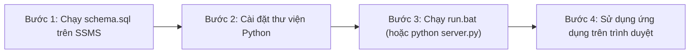

# 🥗 NUTRITFIT - HỆ THỐNG THEO DÕI DINH DƯỠNG, THỂ TRẠNG & GỢI Ý THỰC ĐƠN VIỆT

> **Đồ án / Dự án**: Ứng dụng Quản trị Dinh dưỡng & Vận động Thể chất Cá nhân hóa  
> **Kiến trúc**: Client - Server - Database (Front-end Web SPA + Back-end RESTful API + Hệ quản trị CSDL Microsoft SQL Server + AI Engine)

---

## 📌 MỤC LỤC
1. [Giới Thiệu Tổng Quan & Công Nghệ Sử Dụng](#-giới-thiệu-tổng-quan--công-nghệ-sử-dụng)
2. [Cấu Trúc Thư Mục & Chú Thích Chi Tiết Từng File](#-cấu-trúc-thư-mục--chú-thích-chi-tiết-từng-file)
3. [Quy Trình Cài Đặt & Khởi Động Từng Bước (Chuẩn 100%)](#-quy-trình-cài-đặt--khởi-động-từng-bước-chuẩn-100)
4. [Danh Sách Tài Khoản Thử Nghiệm Sẵn Có](#-danh-sách-tài-khoản-thử-nghiệm-sẵn-có)
5. [Các Lỗi Thường Gặp & Cách Khắc Phục Nhanh (FAQs)](#-các-lỗi-thường-gặp--cách-khắc-phục-nhanh-faqs)
6. [Hướng Dẫn Chi Tiết Các Chức Năng Nghiệp Vụ](#-hướng-dẫn-chi-tiết-các-chức-năng-nghiệp-vụ)

---

## 🌟 GIỚI THIỆU TỔNG QUAN & CÔNG NGHỆ SỬ DỤNG

NutriFit là giải pháp công nghệ toàn diện giúp người dùng Việt Nam theo dõi sức khỏe, kiểm soát năng lượng nạp vào/tiêu hao và xây dựng thực đơn bữa ăn gia đình chuẩn khoa học.

### 🛠️ Kiến Trúc Công Nghệ
- **Front-end (Giao diện người dùng SPA)**:
  - HTML5, CSS3, Tailwind CSS (giao diện hiện đại, responsive đa kích thước màn hình).
  - Thư viện biểu tượng vector **Lucide Icons**.
  - Thư viện biểu đồ **Chart.js** (vẽ biểu đồ cột thống kê tần suất vận động 7 ngày).
- **Back-end (Máy chủ trung gian RESTful API)**:
  - Ngôn ngữ: **Python 3** (Python 3.10 / 3.13).
  - Framework: **Flask**, **Flask-CORS** (cung cấp chuẩn REST API JSON).
  - Kết nối CSDL: **PyODBC** với SQL Server Native Client / ODBC Driver 17/18.
- **Hệ quản trị Cơ sở dữ liệu (DBMS)**:
  - **Microsoft SQL Server (MSSQL)** quản lý qua **SQL Server Management Studio (SSMS)**.
  - Tên CSDL: `NutriFitDB`.
- **Trí tuệ nhân tạo (AI)**:
  - Tích hợp **Google Gemini Flash API** kết hợp **Bộ engine thực đơn dinh dưỡng 7 ngày xoay vòng** độc quyền cho ẩm thực truyền thống Việt Nam.

---

## 📁 CẤU TRÚC THƯ MỤC & CHÚ THÍCH CHI TIẾT TỪNG FILE

Dưới đây là sơ đồ cấu trúc và vai trò của từng tệp tin trong toàn bộ thư mục dự án `FoodAndHealth/`:

```text
FoodAndHealth/
│
├── index.html              # Giao diện Web SPA chính (Dashboard, Thể trạng, Thực đơn, Bài tập)
├── api.js                  # Lớp Client giao tiếp REST API (Fetch API tới Backend Flask)
├── server.py               # Máy chủ Backend Flask kết nối Microsoft SQL Server & Gemini AI
├── vietnamese_menus.py     # Thư viện thực đơn truyền thống Việt Nam 7 ngày (Trưa & Tối)
├── schema.sql              # Kịch bản T-SQL khởi tạo CSDL NutriFitDB, 5 bảng và dữ liệu mẫu
├── run.bat                 # File thực thi 1-Click: Tự động khởi động Backend và mở Web
├── feature.txt             # Tài liệu đặc tả yêu cầu nghiệp vụ gốc của đồ án
├── storage.js              # File dữ liệu tĩnh đối chiếu (đã nâng cấp lên SQL Server)
├── README.md               # Tài liệu hướng dẫn sử dụng và bàn giao kỹ thuật của nhóm
│
└── meal-suggest/           # Module mở rộng: Gợi ý món lẻ mua ngoài & thuật toán xếp hạng AI
    ├── index.html          # Trang xem độc lập cho module món lẻ
    ├── app.js              # Controller xử lý giao diện cho module món lẻ
    ├── single-dishes.js    # Kho dữ liệu hơn 40 món ăn đường phố/quán cơm kèm giá tiền VNĐ
    ├── full-menus.js       # Dữ liệu thực đơn mâm cơm gia đình tham khảo
    ├── ai-rank.js          # Thuật toán AI xếp hạng món lẻ theo ngân sách và calo
    └── api-client.js       # Client API phụ trợ cho module món lẻ
```

### Bảng chú thích chi tiết từng file:

| Tên File / Thư mục | Công nghệ | Vai trò & Tác dụng cụ thể |
| :--- | :--- | :--- |
| **`index.html`** | HTML5, Tailwind CSS, JS, Chart.js | **Giao diện chính (Front-end SPA)** của toàn bộ ứng dụng. Bao gồm: Màn hình Đăng nhập/Đăng ký tinh gọn; Màn hình Khảo sát thể trạng 4 bước; Dashboard quản lý calo & macro (C-P-F); Khu vực gợi ý thực đơn trưa/tối; Khu vực độc lập Món lẻ mua ngoài; Danh mục bài tập và Biểu đồ cột tần suất luyện tập. |
| **`api.js`** | JavaScript (ES6 Fetch) | **Lớp kết nối Front-end với Back-end (API Client)**. Định nghĩa module `NutriFitAPI` với các hàm gọi API bất đồng bộ: đăng nhập, đăng ký, lưu hồ sơ thể trạng, sinh thực đơn AI, chọn món ăn, lấy danh mục bài tập, thêm/xóa bài tập tùy chỉnh, ghi nhận buổi tập, lấy thống kê tần suất. Hỗ trợ bắt lỗi mất kết nối thông minh. |
| **`server.py`** | Python (Flask, PyODBC) | **Máy chủ Back-end RESTful API**. Lắng nghe tại cổng `http://localhost:5000`, nhận request từ `api.js`, xác thực dữ liệu, truy vấn/lưu trữ an toàn vào Microsoft SQL Server (`NutriFitDB`), xử lý đăng nhập không phân biệt hoa thường theo cả Email và Username, gọi Gemini Flash AI. |
| **`vietnamese_menus.py`** | Python | **Thư viện thực đơn Việt Nam 7 ngày**. Chứa kho thực đơn phong phú từ Thứ Hai đến Chủ Nhật (bữa trưa no lâu vs bữa tối thanh đạm) chuẩn 5 món truyền thống, cơ chế xoay vòng thực đơn và sinh prompt cho AI Gemini để không bị trùng lặp món. |
| **`schema.sql`** | T-SQL (MSSQL) | **Kịch bản khởi tạo Cơ sở dữ liệu**. Tạo CSDL `NutriFitDB`, thiết lập 5 bảng chuẩn (`Users`, `UserProfiles`, `Workouts`, `WorkoutLogs`, `MealSuggestions`), nạp sẵn các tài khoản mẫu và 18 bài tập thể thao/gym/cardio chuẩn. |
| **`run.bat`** | Windows Batch Script | **Khởi động 1-Click**. Tự động mở cửa sổ chạy `python server.py` trên cổng 5000 và kích hoạt trình duyệt mở `index.html` chỉ với một lần nhấp đúp chuột. |
| **`feature.txt`** | Text Document | **Đặc tả nghiệp vụ gốc** của đồ án (cấu trúc bài tập, thời gian, calo, tự thêm bài tập, xóa bài tập tự tạo, lưu lịch sử, biểu đồ tần suất vận động, gợi ý món ăn...). |
| **`meal-suggest/`** | Thư mục JS, HTML | **Module Món lẻ mua ngoài**. Chứa `single-dishes.js` (kho >40 món ăn đường phố kèm giá tiền VNĐ), `ai-rank.js` (thuật toán AI lọc và xếp hạng theo ngân sách), và trang demo độc lập. File `index.html` tái sử dụng trực tiếp các file dữ liệu này. |
| **`storage.js`** | JavaScript | File dữ liệu tĩnh ban đầu (được giữ lại để đối chiếu kiến trúc). Toàn bộ dữ liệu thực tế hiện tại đã được nâng cấp lưu bền vững vào SQL Server. |
| **`README.md`** | Markdown | Tài liệu hướng dẫn sử dụng và bàn giao kỹ thuật của dự án. |

---

## 🚀 QUY TRÌNH CÀI ĐẶT & KHỞI ĐỘNG TỪNG BƯỚC (CHUẨN 100%)

> [!IMPORTANT]
> **Quy tắc quan trọng**: Trình duyệt Web bảo mật không thể kết nối trực tiếp vào CSDL SQL Server nếu thiếu máy chủ trung gian. Do đó, **hãy luôn thực hiện theo đúng 4 bước dưới đây**:



---

### BƯỚC 1: Khởi tạo CSDL trên SQL Server Management Studio (SSMS)
*(Chỉ cần thực hiện 1 lần duy nhất khi thiết lập dự án trên máy mới)*

1. Mở phần mềm **SQL Server Management Studio (SSMS)**.
2. Nhấn nút **Connect** để kết nối vào máy chủ SQL Server của bạn (Server name: `.` hoặc `localhost`, Authentication: *Windows Authentication*).
3. Trong SSMS, nhấn tổ hợp phím **`Ctrl + O`**, duyệt đến thư mục dự án và chọn file **`schema.sql`**.
4. Nhấn phím **`F5`** (hoặc bấm nút **Execute** màu xanh trên thanh công cụ).
5. Khi thanh thông báo hiển thị:
   ```text
   Commands completed successfully.
   ```
   $\rightarrow$ CSDL **`NutriFitDB`** cùng toàn bộ 5 bảng, tài khoản mẫu và 18 bài tập mặc định đã được tạo thành công!

---

### BƯỚC 2: Cài đặt thư viện Python cho Backend

Mở cửa sổ dòng lệnh (**PowerShell** hoặc **Command Prompt**) tại thư mục `FoodAndHealth`, chạy lệnh:

```powershell
pip install flask flask-cors pyodbc requests
```

*Giải thích các gói cần thiết:*
- `flask`: Tạo web service REST API.
- `flask-cors`: Cho phép giao diện web gọi API cục bộ không bị chặn CORS Policy.
- `pyodbc`: Driver kết nối Python với Microsoft SQL Server (`ODBC Driver 17/18`).
- `requests`: Gửi yêu cầu HTTP đến Gemini Flash AI.

---

### BƯỚC 3: Khởi động hệ thống

#### Cách 1: Sử dụng kịch bản 1-Click (Khuyên dùng)
- Nhấp đúp chuột (**Double-click**) vào file **`run.bat`**.
- File kịch bản sẽ tự động mở cửa sổ chạy `server.py` và tự bật trình duyệt web cho bạn.

#### Cách 2: Chạy thủ công bằng dòng lệnh
Tại thư mục dự án, chạy lệnh:
```powershell
python server.py
```
Khi màn hình xuất hiện thông báo:
```text
NutriFit Backend Server is running at http://localhost:5000 ...
 * Running on http://127.0.0.1:5000
```
$\rightarrow$ Backend đã sẵn sàng! Mở file **`index.html`** trên trình duyệt để sử dụng.  
*(⚠️ Lưu ý: Giữ nguyên cửa sổ terminal chạy Python trong suốt quá trình sử dụng)*.

---

## 👥 DANH SÁCH TÀI KHOẢN THỬ NGHIỆM SẴN CÓ

Hệ thống đã nạp sẵn các tài khoản thử nghiệm trong CSDL `NutriFitDB` (hỗ trợ đăng nhập linh hoạt bằng cả **Email** hoặc **Tên/Username**):

| Tên đăng nhập / Email | Mật khẩu | Họ và tên | Trạng thái tài khoản |
| :--- | :--- | :--- | :--- |
| `demo@nutrifit.vn` | `123456` | Lê Phú Quý | **Tài khoản chính**: Đã thiết lập đầy đủ hồ sơ thể trạng (24 tuổi, 68kg, 172cm), mục tiêu giảm cân, đã có lịch sử thực đơn. |
| `admin1` | `123456` | admin1 | Tài khoản Quản trị viên (27 tuổi, 77kg, 172cm). |
| `test` (hoặc `Khoa`) | `123456` | Khoa | Tài khoản Thành viên (22 tuổi, 52kg, 172cm, mục tiêu tăng cân). |

> [!TIP]
> **Cơ chế Ngoại tuyến dự phòng (Offline Fallback)**: Nếu bạn mở file `index.html` mà quên chưa bật `server.py`, hệ thống vẫn cho phép đăng nhập các tài khoản mẫu trên để bạn xem trước giao diện và trải nghiệm các tính năng mà không bị kẹt ở màn hình đăng nhập.

---

## 🛠️ CÁC LỖI THƯỜNG GẶP & CÁCH KHẮC PHỤC NHANH (FAQS)

### 1. Bấm Đăng nhập nhưng không có phản hồi?
- **Cách khắc phục**:
  1. Kiểm tra xem bạn đã mở `server.py` chưa. Tốt nhất hãy nhấp đúp file **`run.bat`**.
  2. Tải lại trang bằng tổ hợp phím **`Ctrl + F5`** trên trình duyệt để đảm bảo trình duyệt nhận bản mã nguồn JavaScript mới nhất (tránh lưu cache cũ).

### 2. Khi chạy `python server.py` bị lỗi `pyodbc.Error` kết nối SQL Server?
- **Nguyên nhân 1**: Dịch vụ SQL Server chưa được bật.  
  $\rightarrow$ *Khắc phục*: Nhấn phím `Windows + R`, gõ `services.msc`, tìm dịch vụ `SQL Server (MSSQLSERVER)` và bấm **Start**.
- **Nguyên nhân 2**: Máy dùng phiên bản SQL Server Express (`.\SQLEXPRESS`).  
  $\rightarrow$ *Khắc phục*: Trong file `server.py`, chuỗi kết nối đã hỗ trợ `ODBC Driver 18` và `Driver 17` với `TrustServerCertificate=yes`. Bạn có thể đổi `SERVER=localhost` thành `SERVER=.\\SQLEXPRESS` nếu cần.

### 3. F5 lại trình duyệt có bị mất dữ liệu hay bị bắt đăng nhập lại không?
- **Không bao giờ bị mất!** Hệ thống đã cấu hình tự động lưu session người dùng (`nutrifit_session_user`). Khi F5, hệ thống sẽ tự động đồng bộ lại số đo thể trạng, lịch sử tập luyện và thực đơn từ SQL Server.

### 4. Tại sao một số ô số đo cơ thể bị viền đỏ và không cho ấn "Tiếp tục"?
- Hệ thống áp dụng **bộ ràng buộc logic sinh học**:
  - Chiều cao: **100 cm – 250 cm**.
  - Cân nặng: **30 kg – 250 kg**.
  - Độ tuổi: **12 – 95 tuổi**.
  - Chỉ số BMI tương quan phải thuộc khoảng sinh tồn ($11 \le \text{BMI} \le 65$).  
  Nếu nhập ngoài ngưỡng này, hệ thống sẽ báo đỏ và chỉ dẫn cụ thể.

---

## 📖 HƯỚNG DẪN CHI TIẾT CÁC CHỨC NĂNG NGHIỆP VỤ

### 1. Quản Lý Thể Trạng & Hồ Sơ Sức Khỏe
- **Tính toán chỉ số khoa học tự động**:
  - **BMI (Chỉ số khối cơ thể)**: Công thức chuẩn $\text{BMI} = \frac{\text{Cân nặng (kg)}}{[\text{Chiều cao (m)}]^2}$ kèm phân loại chuẩn WHO cho người châu Á (*Thiếu cân, Bình thường, Thừa cân, Béo phì*).
  - **BMR (Chuyển hóa cơ bản)**: Năng lượng tối thiểu duy trì sự sống (công thức Mifflin-St Jeor).
  - **TDEE (Tiêu hao hàng ngày)**: Tính theo hệ số vận động (1.2 – 1.55).
  - **Calo mục tiêu cần ăn**: Cân đối theo mục tiêu (Giảm mỡ: thâm hụt 500 kcal, Duy trì: bằng TDEE, Tăng cân: thặng dư 350 kcal).
  - **Nhu cầu nước khuyến nghị**: $35\text{ ml} \times \text{Cân nặng (kg)}$.
- **Nút chữ `i` thông tin**: Trên góc các thẻ BMR, TDEE, Calo mục tiêu, Nước đều có biểu tượng `i`. Rê chuột vào sẽ hiện giải thích chi tiết ý nghĩa và công thức y học cho người dùng.
- **Nút "Cập nhật số đo mới"**: Cho phép thay đổi cân nặng, chiều cao, mục tiêu bất kỳ lúc nào với tính năng tự động tính và hiển thị ngay BMI trực tiếp khi đang gõ.

### 2. Gợi Ý Thực Đơn Bữa Ăn Việt (Dinh Dưỡng Khoa Học)
- **2 Chế độ theo nhịp sinh học**:
  - ☀️ **Bữa trưa (Ăn no)**: Năng lượng dồi dào (~40% calo ngày), món đạm chắc giúp no lâu làm việc buổi chiều.
  - 🌙 **Bữa tối (Dễ tiêu)**: Năng lượng thanh nhẹ (~30% calo ngày), ưu tiên món luộc/hấp, canh thanh nhiệt giúp ngủ sâu giấc.
- **3 Lựa chọn thực đơn đa dạng**: Đề xuất 3 thực đơn chuẩn 5 thành phần (Tinh bột, Đạm mặn, Canh, Rau xơ, Tráng miệng).
- **Thanh chú thích Macro (C - P - F)**: Phía trên các thực đơn có giải thích rõ ràng:
  - 🌾 **C (Carbs / Tinh bột)**: Nguồn năng lượng chính cho cơ thể.
  - 🥩 **P (Protein / Chất đạm)**: Nuôi dưỡng và phục hồi cơ bắp.
  - 🥑 **F (Fat / Chất béo lành mạnh)**: Hấp thụ vitamin và cân bằng nội tiết.
- **Nút "🔄 Đổi thực đơn khác"**: Đổi mới 3 gợi ý thực đơn khác khi muốn đổi khẩu vị.
- **Nút thứ 4: "Để tôi suy nghĩ / Quyết định sau"**: Bảo lưu trạng thái chờ, giữ nguyên vẹn 3 gợi ý ban đầu để chọn lại sau mà không bị xáo trộn.
- **Nút "📜 Lịch sử"**: Xem lại toàn bộ các thực đơn đã chọn trong các ngày trước từ CSDL.

### 3. Chức Năng Món Lẻ Mua Ngoài (Dành Cho Dân Văn Phòng / Ăn Ngoài)
- **Tách thành chức năng độc lập**: Có mục riêng trên thanh điều hướng đầu trang, dễ dàng cuộn đến hoặc chọn trực tiếp.
- **Kho dữ liệu hơn 40 món ăn ngoài quen thuộc**: Phở bò, Bún chả, Cơm tấm, Bánh mì, Hủ tiếu, Bún bò Huế... kèm giá tiền (VNĐ), calo và dinh dưỡng C-P-F.
- **Ràng buộc ngân sách tối đa nghiêm ngặt**:
  - Không cho phép nhập số âm hoặc chữ/ký tự lạ.
  - Mức giá tối thiểu hợp lệ: **10.000đ/phần**.
  - Mức giá tối đa hợp lệ: **500.000đ/phần**.
  - Nếu nhập sai sẽ báo viền đỏ trực tiếp kèm thông báo hướng dẫn cụ thể.
- **Nút "📍 Quán gần nhất"**: Tích hợp liên kết Google Maps tự động tìm các quán ăn bán món tương ứng quanh vị trí của người dùng.

### 4. Lập Lịch Tập & Vận Động Thể Lực (Tuân thủ feature.txt)
- **18 Bài tập cài đặt sẵn chuẩn**: Phân loại theo 4 nhóm (*Cardio, Kháng lực Gym, Thể thao, Yoga & Giãn cơ*). Mỗi bài tập đều ghi rõ: **Tên**, **Thời gian (phút)**, **Calo đốt (kcal)**.
- **Thêm hoạt động tự tạo**: Cho phép người dùng tự tạo bài tập riêng của mình và lưu trữ vào CSDL SQL Server.
- **Nút Xóa bài tập tự tạo**: Người dùng có thể xóa bài tập do chính mình tạo ra (các bài tập mặc định của hệ thống được bảo vệ an toàn).
- **Ghi nhận buổi tập**: Bấm *"Ghi nhận tập"* để lưu vào lịch sử thời gian thực.
- **Biểu đồ cột trực quan (Chart.js)**: Thống kê tần suất 7 ngày gần nhất, chuyển đổi linh hoạt giữa 3 thước đo:
  - ⏱️ Thời gian tập (phút)
  - 🔥 Calo tiêu hao (kcal)
  - 📊 Số buổi tập
- Cung cấp 4 thẻ chỉ số nhanh: Tổng số buổi tập, Tổng thời lượng, Tổng calo đốt và Số ngày hoạt động trong tuần.